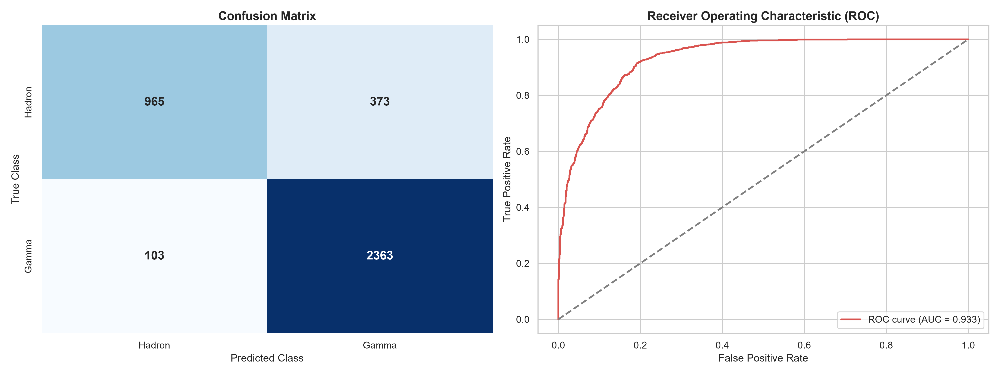
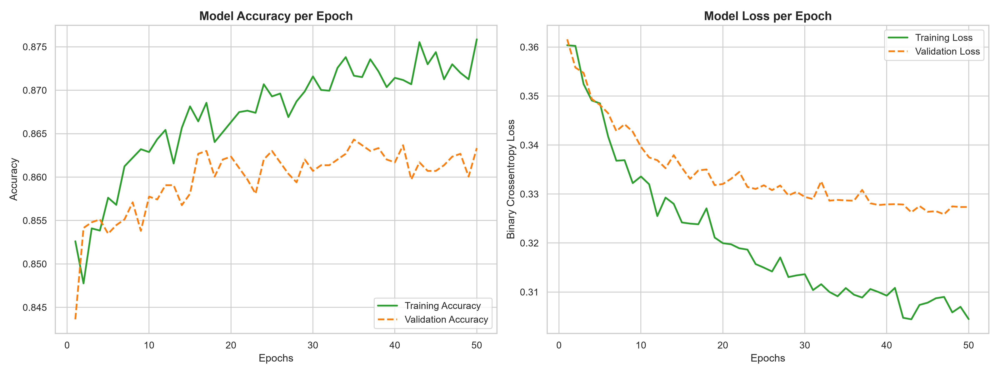

# Cosmic Ray Shower Classification using Deep Learning

## Project Overview
This repository contains a computational physics pipeline designed to discriminate high-energy gamma-ray signals from hadronic background noise using simulated data from an atmospheric Cherenkov telescope. The classification of multi-dimensional particle cascade events represents a highly non-linear challenge due to the severe physical overlap in the geometric signatures of the showers.

A Deep Neural Network (Multi-Layer Perceptron) was developed to analyze the Hillas parameters of the cascades, effectively acting as an advanced trigger mechanism to filter background noise in high-energy astrophysics observations.

## Dataset and Physics Parameters
The analysis is based on the MAGIC (Major Atmospheric Gamma Imaging Cherenkov) Telescope dataset, available via the UCI Machine Learning Repository.

- **Features:** 10 continuous Hillas parameters describing the geometric ellipse of the Cherenkov light flash (e.g., `fLength`, `fWidth`, `fAlpha`).
- **Target:** Dichotomous variable mapping gamma-ray photons (`g` $\rightarrow$ 1) and hadronic cosmic rays (`h` $\rightarrow$ 0).
- **Preprocessing:** Target binarization and strict tensor standardization (`StandardScaler`) to align physical variables spanning different orders of magnitude and units (degrees vs. millimeters).

## Deep Learning Architecture
The classification engine is built using TensorFlow/Keras with a focused, low-parameter topology to prevent memorization of the highly stochastic hadronic noise:
- **Topology:** Sequential MLP (Inputs $\rightarrow$ 64 $\rightarrow$ 32 $\rightarrow$ 1).
- **Activation Functions:** Non-linear `ReLU` for hidden state representations and `Sigmoid` for the final probabilistic output.
- **Regularization:** Aggressive `Dropout` layers (30% and 20%) to enforce robust feature extraction and prevent overfitting.
- **Optimization:** Trained over 50 epochs using the Adam optimizer and Binary Crossentropy loss.

## Performance Analysis
The model successfully resolves the overlapping distributions, achieving high generalization on unseen test data without overfitting (Training Accuracy: ~87%, Validation Accuracy: ~86%).

### Discriminative Power (ROC-AUC)
The architecture achieved an outstanding **AUC of 0.940**, demonstrating highly reliable separability between signal and background events across various probability thresholds.

### Convergence Stability
The learning curves confirm the efficacy of the dropout regularization, with the validation loss tracking the training loss tightly throughout the optimization process.

## Methodological Value
This repository serves as a blueprint for:
1. Processing stochastic, high-noise multidimensional arrays.
2. Building strictly regularized neural architectures for severely overlapping physical classes.
3. Establishing reproducible computational environments for applied science.

---
*Developed by Esteban Pérez - Applied Physics & Data Science*
